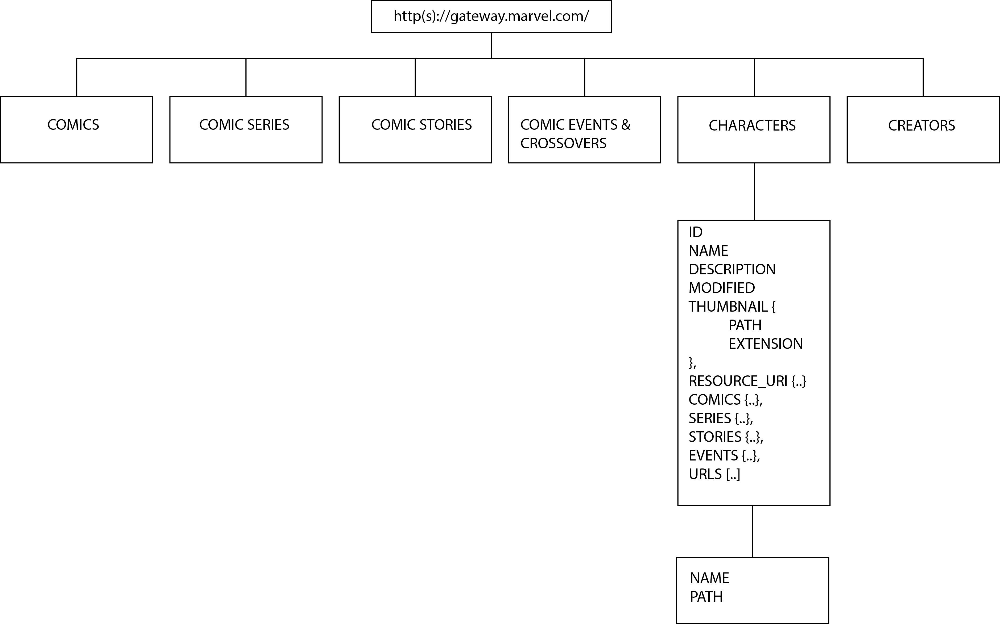

# Real time web


## Live demo 💻
You can check out the live demo [here](https://chatbox-kiki.herokuapp.com/)

## 3 < 1 concept
For this course I had to think of three different ideas that implement realtime data with Socket.io and the use of an API.

### Guess the Marvel character ❓
I found out that Marvel has their own API. I really wanted to make a game based on all the characters from the Marel Universe. This game will contain a chatbox where the users can communicate and send their answers.


### Yahtzee 🎲
My first thought for this course was to make my all time favourite game, Yahtzee. I know there are/is API's for rolling dices.  


### Pesten (Dutch card game) ♠️♥️♣️♦️
I knew that there was an API for decks for cards, so I thought it would be cool to replicate this Dutch card game. 
* You'll need a minimum of two players. 
* Every player gets zeven cards and all the leftover cards will be in the pile on the table.
* The goal of the game is to lose your cards as soon as possible but there are certain rules when you can play a card away.


##  Installation ⚙️
#### Clone repo
```
$  git clone https://github.com/kiara1404/real-time-web-2122
```

#### Install dependencies
```
$ npm install
```

#### Start application

```
$ npm start
```

### Dependencies
* [ExpressJS](https://expressjs.com/)
* [ejs](https://www.npmjs.com/package/ejs)
* [Dotenv](https://www.npmjs.com/package/dotenv)
* [cross-fetch](https://www.npmjs.com/package/cross-fetch)
* [socket.io](https://www.npmjs.com/package/socket.io)


## External data source 💾
I am using the official [Marvel API](https://developer.marvel.com/). You have to request an official API key for developers by creating an account but you'll receive the key quite easily. 


## Real time events ⏰
### Connection
This event is the main event. It's performs when a user makes a new connection with the server. This is the connection with the socket.

### User connect
This event gets triggered when a new user is connecting with the game. It sends the username and triggers a join message with the username so everyone in the game can see who joined.

### Message
This event is performed when a user wants to send a message in the chat, this can be to chat with others or to guess the answer for the game.

### Get data ( new character )
This events gets triggered when the user enters the chat after sending their username. The marvel API data will be collected and filtered and a random item from the array will be shown.
It gets triggered again after the former question gets answered right.

### Answer
When a user is attempting to guess the right answer, this event gets triggered. When a chat message is send, it will be checked if the message contains the right answer. If this is the case, another message will be shown saying the right answer has been given.

### User left
This event gets performed when a user leaves. It makes sure a message is sent that a user has left (with their username).


## Data management

## Data lifecycle


## ⚖ License
[MIT](https://github.com/kiara1404/real-time-web-2122/blob/main/LICENSE)


## ✍ Author
- [@kiara1404](https://github.com/kiara1404)
